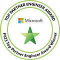

## About me

 

**Tatsuro Shibamura (shibayan)** 
Developer / Microsoft MVP for Microsoft Azure / Windows on Arm Enthusiast

|  |  |
| ------------- | ------------- |

## Awards

<dl>
  <dt>Microsoft MVP for Microsoft Azure</dt>
  <dd>2018 ~ 2025</dd>
  <dt>Microsoft MVP for Visual Studio and Development Technologies</dt>
  <dd>2015 ~ 2018</dd>
  <dt>Microsoft MVP for ASP.NET/IIS</dt>
  <dd>2011 ~ 2015</dd>
</dl>

<dl>
  <dt>Microsoft Top Partner Engineer Award &lt;Azure&gt;</dt>
  <dd>2023 ~ 2025</dd>
</dl>

## Certifications

## Connections

